# 简介
iBiz产品生命周期管理（iBiz Product Lifecycle Management，简称iBizPLM）作为新一代的研发管理平台，其设计宗旨在于通过简化操作界面，实现研发管理流程的自动化、数字化及智能化，以此帮助企业加快研发进度。该平台充分汲取 [pingcode项目管理软件](https://gitee.com/link?target=https%3A%2F%2Fpingcode.com%2F) 的核心思想，覆盖了软件生产过程中的产品、项目、文档、测试等领域。
# 系统功能

- **产品管理**：产品管理是iBizPLM中负责产品及需求管理的子产品，通过收集来自于产品规划、客户反馈、内部需求等不同渠道的需求形成对应工单，并根据业务规划进行需求评审，最终对需求形成优先级列表和排期。
- **项目管理**：项目管理是iBizPLM中负责管理项目的子产品，支持标准的敏捷开发模型Scrum和Kanban，以及瀑布开发模型，方便团队按照自己的开发模型选择项目类型进行项目管理。
- **测试管理**：测试管理是iBizPLM中负责测试管理的子产品，通过测试用例的维护管理、测试用例评审，制定测试计划及执行测试计划，自动生成测试报告。
- **知识管理**：知识管理是iBizPLM中负责管理知识体系的子产品，提供结构化空间来记载信息和知识，便于团队沉淀经验、共享资源，支持多人同时在线编辑，文档版本回溯等。
- **效能度量**：效能度量是iBizPLM中负责分析研发效能的子产品，把研发管理过程中使用的过程数据，通过自动化的方式收集、加工、清洗，最终以可视化的效能仪表盘形式展现，进行效能分析与洞察。
- **协作空间**：协作空间是iBizPLM中负责管理协作交流子产品，通过邀请成员参与话题，并围绕话题开展讨论，让信息传播更快捷，让活动征集更高效，让成员发言更积极。支持话题面向组织或团队，构建自由灵活的讨论环境；支持丰富的讨论内容，让信息传播更直观高效；支持邀请成员参与话题和讨论，在交流中征集信息与资源。
- **自 动 化**：自动化是iBizPLM中用于规划业务流程自动化的子产品，旨在优化业务流程，通过实施自动化规则，显著减少团队成员的手动工作量。使得原本繁琐且重复的任务能够自动完成，从而提高效率和精准度。通过配置特定的规则，它能够实现流程的自动化管理，有效降低人力成本和错误率。

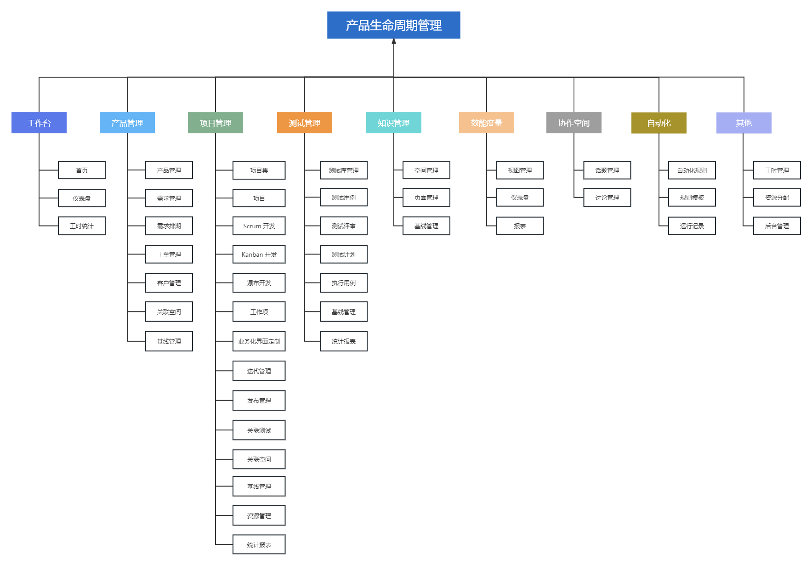
# 在线体验
- PC端-演示地址：[http://plm.ibizlab.cn/ibizplm-plmweb/](http://plm.ibizlab.cn/ibizplm-plmweb/)
- 移动端-演示地址（Demo版）：[http://mob.plm.ibizlab.cn/ibizplm-plmmob/](http://mob.plm.ibizlab.cn/ibizplm-plmmob/)
- 演示管理员账号/密码：demo_admin/123456
- 演示普通用户账号/密码：demo_user/123456
# 系统架构
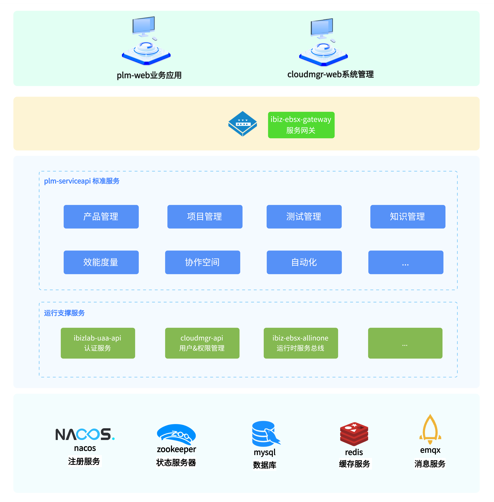<br>
**前端技术**

- 前端MVVM框架：vue.js@3.3.8
- 路由：vue-router@4.2.5
- 状态管理：pinia@2.1.7
- 国际化：vue-i18n@9.5.0
- UI框架：element-plus@2.4.1

**后端技术**

- 基于 Spring Boot 提供应用配置简化
- Maven 构建，测试，运行应用
- Spring Security 组件
- JSON Web令牌（JWT）身份验证安全机制
- Spring MVC REST + Jackson
- Swagger 来自动生成 REST Controller API 文档
- Zalando Problem Spring Web 处理异常
- Mybatis-plus
- 基于 Liquibase 数据库更新
- 构建标准可执行的JAR文件
- SpringCloud Gateway 服务网关
- 基于 Nacos 的服务发现与配置管理
- 基于 Feign 的服务消费客户端
- 使用 Caffeine + Redis 提供两级缓存
- 完整的 Docker 和 Docker Compose 支持

**项目结构**<br>
主要分为 plm-core、plm-serviceapi 和 plm-user 三个子项目，以及前台vue代码目录。

- **frontend**：前端vue代码目录，详见 [frontend/README.md](https://gitee.com/ibizlab/plm-code/blob/main/frontend/README.md) 说明。
- **plm-core**：业务核心代码，提供整个系统功能的默认实现，包括 service、domain、mapper 等。
- **plm-serviceapi**：系统服务接口，定义系统对外服务的接口及接口配置。
- **plm-user**：预留的用户扩展目录，可在该目录中重写功能的默认实现。
```java
/plm-code
|-- /frontend                        	--前端vue代码
|-- /plm-core                        	--业务核心代码
|   |-- /src/main/java               	--源码目录
|   |   |-- cn.ibizlab.plm           	--系统包路径
|   |   |   |-- core                 	--业务服务层
|   |   |   |   |-- base             	--模块名
|   |   |   |   |   |-- domain  	 	--实体类
|   |   |   |   |   |-- filter  	 	--搜索项
|   |   |   |   |   |-- mapper  	 	--mybatis-plus 增删改查接口
|   |   |   |   |   |-- service 	 	--实体服务对象
|   |   |   |-- serviceapi      	 	--系统服务接口
|   |   |   |   |-- dto         	 	--服务接口DTO数据对象
|   |   |   |   |-- mapping     	 	--服务接口DTO数据对象转换服务
|   |   |   |   |-- rest        	 	--服务接口
|   |   |   |-- util            	 	--工具类
|   |   |   |   |-- aspect        	 	--切面
|   |   |   |   |-- config        	 	--mybatis-plus、数据库版本配置
|   |   |   |   |-- enums        	 	--枚举
|   |   |   |   |-- job        	     	--任务
|   |-- src/main/resource 			 	--资源文件目录
|   |   |-- i18n           			 	--国际化
|   |   |-- liquibase           	 	--数据库版本管理
|   |   |-- mapper           		 	--mybatis mapper.xml
|-- /plm-serviceapi                  	--系统服务接口配置
|   |-- /src/main/java               	--源码目录
|   |   |-- cn.ibizlab.plm           	--系统包路径
|   |   |   |-- config               	--服务接口配置
|   |   |   |-- serviceapi.rest      	--服务接口
|   |   |   |-- BootApplication.java    --程序主入口
|-- /plm-user                        	--用户扩展目录
|   |-- /src/main/java               	--源码目录
|   |   |-- cn.ibizlab.plm           	--系统包路径
|   |   |   |-- core                 	--业务服务扩展目录
|   |   |   |-- serviceapi.rest      	--服务接口扩展目录
```
# 部署&运行
### 基于docker启动
本项目提供docker版本，您可以通过 docker-compose 启动并运行本项目及其依赖环境，详情参见 [iBizPLM部署](https://gitee.com/ibizlab/plm#%E5%AE%89%E8%A3%85%E9%83%A8%E7%BD%B2)。<br>
### 源码启动
若希望基于以源码方式启动项目，以完成二次开发及实现业务功能定制，可以按照以下步骤完成部署。

- **启动依赖项目**

可通过 docker-compose 启动当前项目运行所需的 mysql、nacos、redis 等基础服务。
```yaml
#Linux OR MacOS  临时设置 IPADDR环境变量为本机ip地址如:192.168.1.3
$ export IPADDR=192.168.1.3 && docker-compose -f plm-serviceapi/src/main/docker/docker-compose.yml up -d
```
```yaml
#Windows  临时设置 IPADDR环境变量为本机ip地址如:192.168.1.3
$ set IPADDR=192.168.1.3 && docker-compose -f plm-serviceapi/src/main/docker/docker-compose.yml up -d
```

- **修改调试依赖服务域名解析地址**

依赖服务均在docker网络内运行，为了本机调试时转接依赖地址，需要修改本机host域名解析，Linux或MacOS修改 /etc/hosts，Windows修改C:\Windows\System32\drivers\etc\hosts
```yaml
#将 nacos.ibizcloud.cn 映射成本机ip地址如:192.168.1.3
$ 192.168.1.3   nacos.ibizcloud.cn
```

- **启动前端**

<span style="background-color: MistyRose;">环境要求：[Node.js](https://gitee.com/link?target=https%3A%2F%2Fnodejs.org) 16及以上版本，详情见 [frontend/README.md](https://gitee.com/ibizlab/plm-code/blob/main/frontend/README.md)</span>
```yaml
$ cd frontend
$ pnpm install && pnpm preview
```

- **启动后端**

<span style="background-color: MistyRose;">环境要求：jdk 1.8 及以上版本</span>

```yaml
#编译器中 Run 或 Debug
plm-serviceapi/src/main/java/cn/ibizlab/plm/BootApplication.java
```

等待启动完成访问 [http://localhost:4173/](https://gitee.com/link?target=http%3A%2F%2Flocalhost%3A4173%2F)
### 编译及打包
您可以根据项目的需求，自行调整代码来完成业务功能的开发与定制，在完成功能开发后，可以通过以下步骤来完成项目编译与打包。
- **编译前端**
```yaml
$ cd frontend
$ pnpm run build
```

- **编译后端**

```yaml
$ mvn package -Pserviceapi
```
# 演示图

#### 工作台

- 工作台-首页

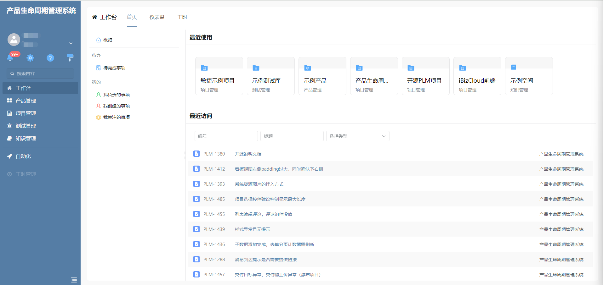

- 工作台-仪表盘

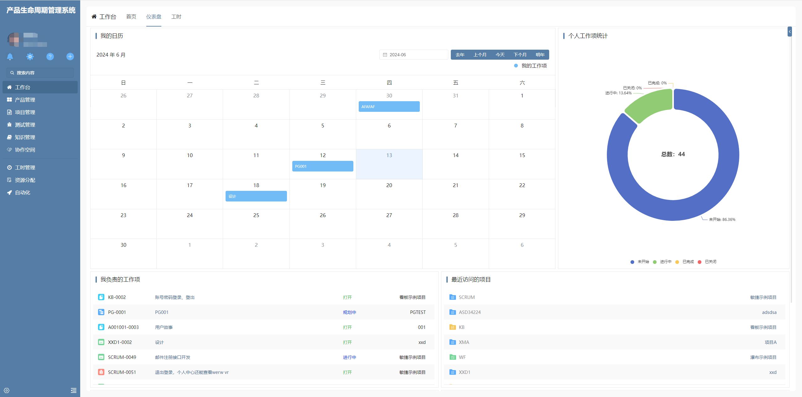

#### 产品管理

- 产品-首页

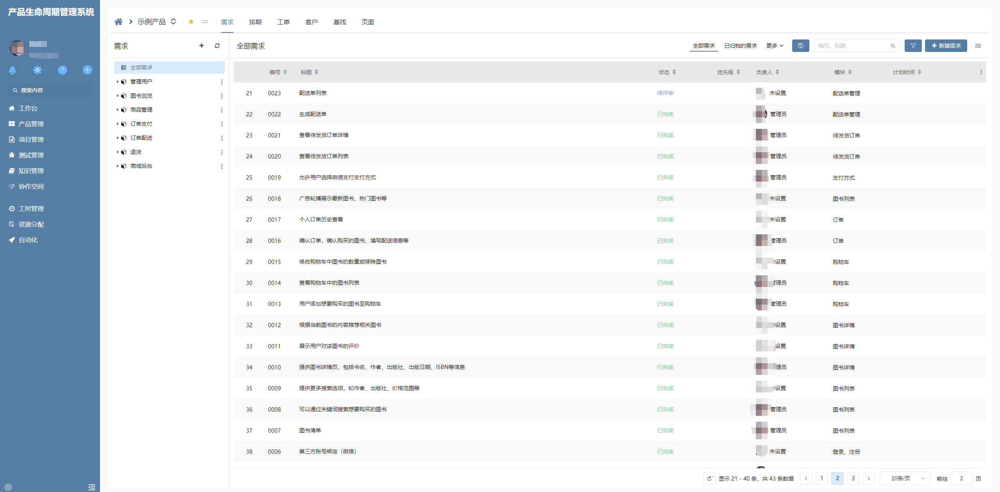

- 产品-需求

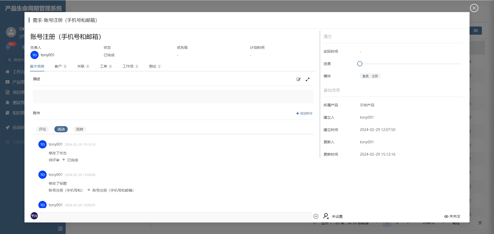

#### 项目管理

- 项目-主页

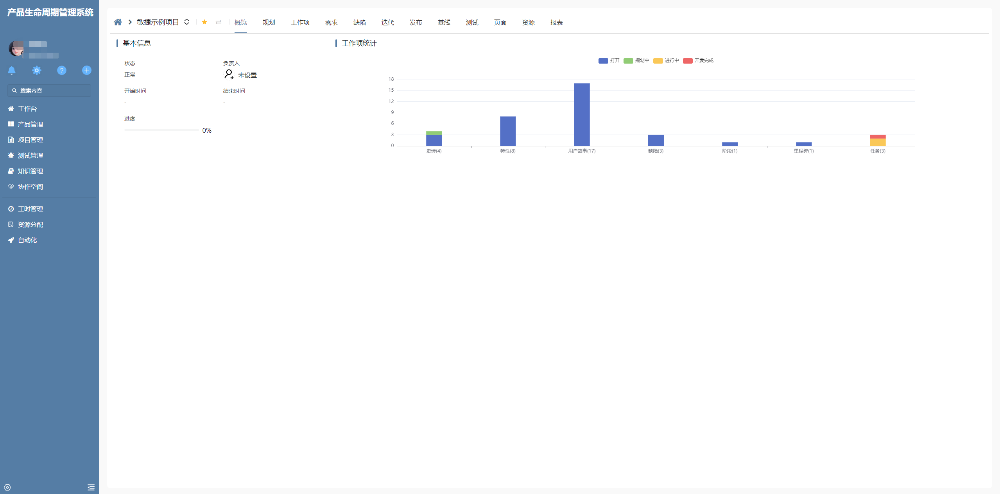

- 项目-工作项

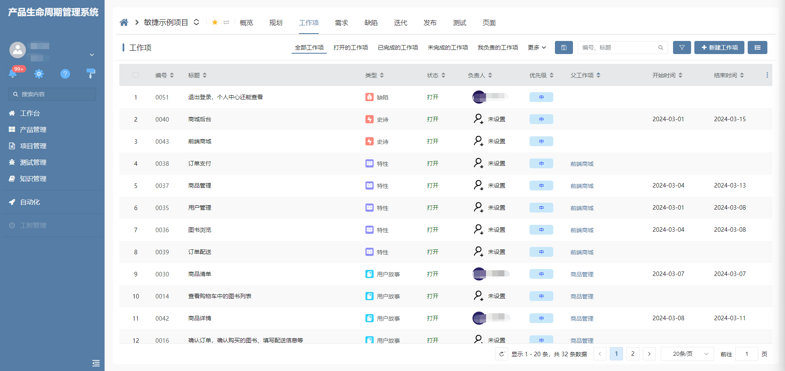
#### 测试管理

- 测试-用例

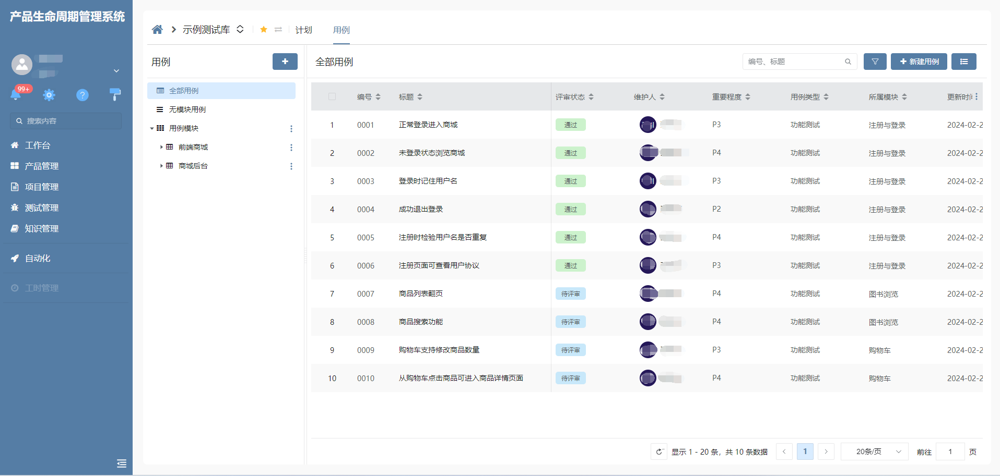

- 测试-用例详情


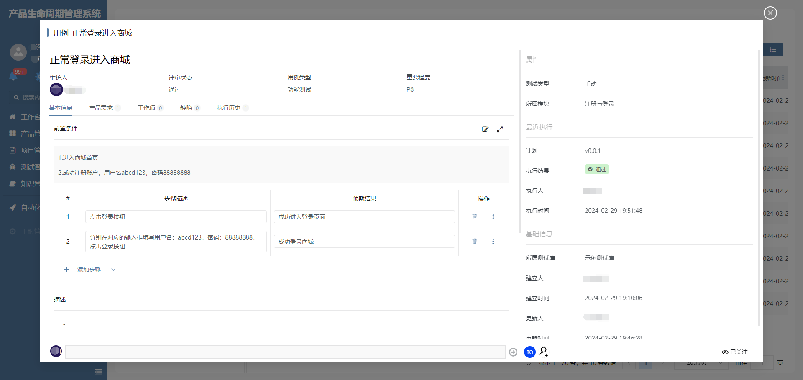

#### 知识管理

- 知识-首页

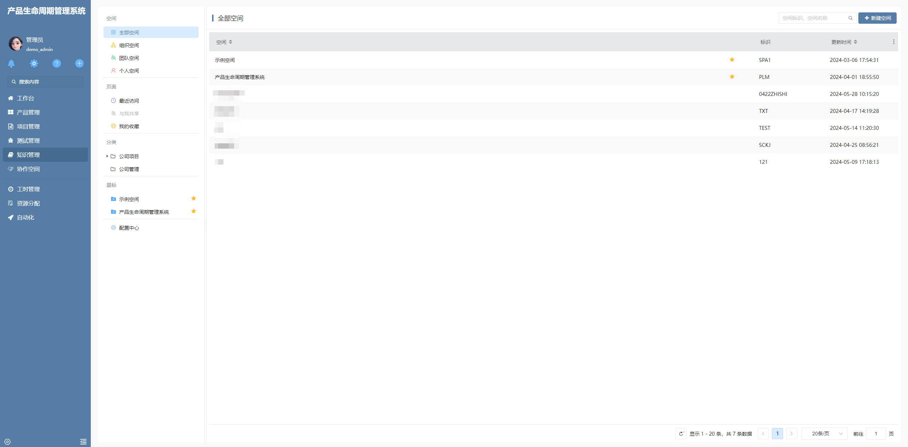

- 知识-页面

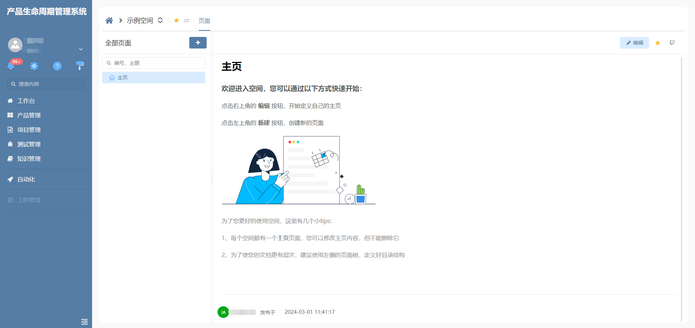

#### 效能度量

- 效能度量-仪表盘

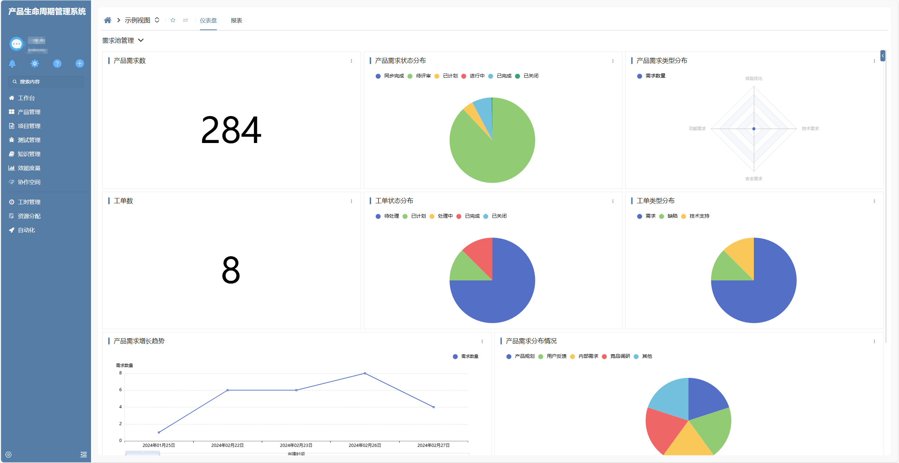

- 效能度量-报表

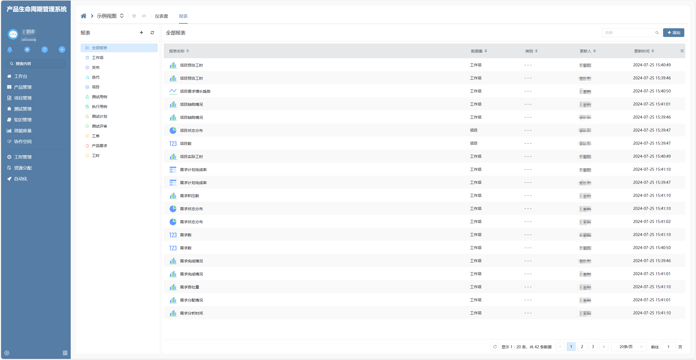

#### 工时管理

- 工时管理-首页

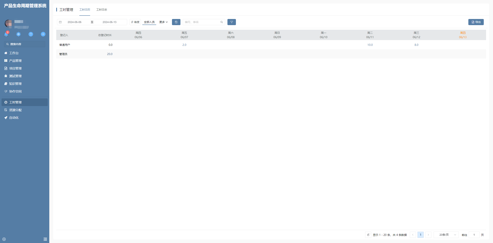

#### 资源分配

- 资源分配-首页

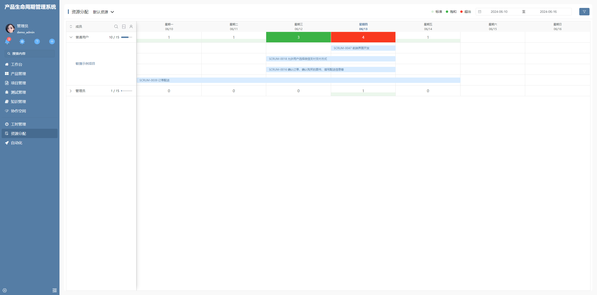

# 附录
[系统功能文档](http://plm.ibizlab.cn/ibizplm-plmweb/#/-/index/-/article_page_help_tree_exp_view/-)<br>
[系统详细设计文档](http://plmdoc.ibizlab.cn)<br>
[系统更新日志(版本迭代说明)](doc/CHANGELOG.md)<br>
[pingcode功能对照表](doc/pingcode-iBizPLM%E5%AF%B9%E7%85%A7%E8%A1%A8.xlsx)<br>
欢迎加入iBizPLM交流QQ群：1067434627
