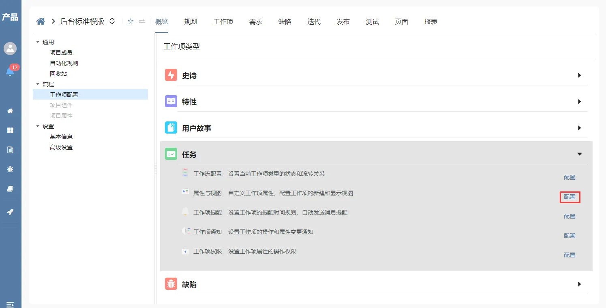
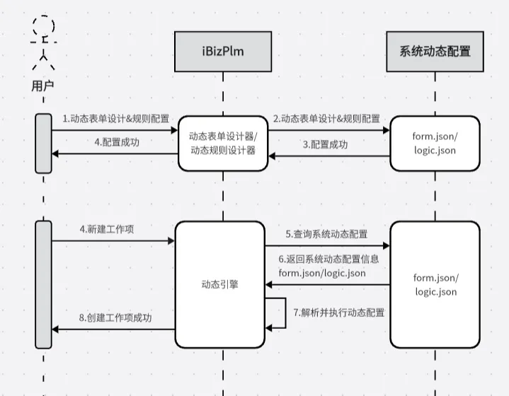
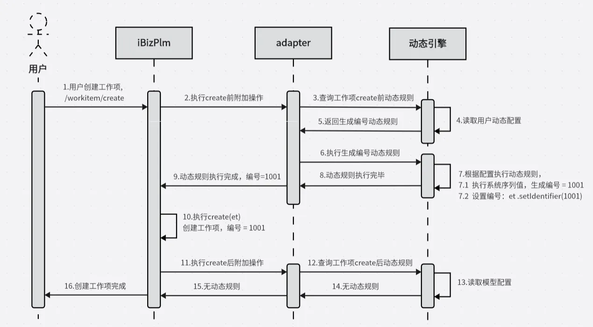

# 简介
iBiz产品生命周期管理（[iBizPLM](https://github.com/iBizLab/plm)）的一套基于 Spring Boot 和 Vue 的轻量级应用程序源码。
# 技术栈
**前端技术栈**
- 前端MVVM框架：vue.js@3.3.8
- 路由：vue-router@4.2.5
- 状态管理：pinia@2.1.7
- 国际化：vue-i18n@9.5.0
- UI框架：element-plus@2.4.1

**微服务技术栈**
- 基于 Spring Boot 提供应用配置简化
- Maven 构建，测试，运行应用
- Spring Security 组件
- JSON Web令牌（JWT）身份验证安全机制
- Spring MVC REST + Jackson
- Swagger 来自动生成 REST Controller API 文档
- Zalando Problem Spring Web 处理异常
- Mybatis-plus
- 基于 Liquibase 数据库更新
- 构建标准可执行的JAR文件
- SpringCloud Gateway 服务网关
- 基于 Nacos 的服务发现与配置管理
- 基于 Feign 的服务消费客户端
- 使用 Caffeine + Redis 提供两级缓存
- 完整的 Docker 和 Docker Compose 支持
# 代码结构
主要分为 plm-core、plm-serviceapi 和 plm-user 三个子项目，以及前台vue代码目录。

- **frontend**：前端vue代码目录，详见 [frontend/README.md](frontend/README.md) 说明。
- **plm-core**：业务核心代码，提供整个系统功能的默认实现，包括 service、domain、mapper 等。
- **plm-serviceapi**：系统服务接口，定义系统对外服务的接口及接口配置。
- **plm-user**：预留的用户扩展目录，可在该目录中重写功能的默认实现。
```java
/plm-code
|-- /frontend                        	--前端vue代码
|-- /plm-core                        	--业务核心代码
|   |-- /src/main/java               	--源码目录
|   |   |-- cn.ibizlab.plm           	--系统包路径
|   |   |   |-- core                 	--业务服务层
|   |   |   |   |-- base             	--模块名
|   |   |   |   |   |-- domain  	 	--实体类
|   |   |   |   |   |-- filter  	 	--搜索项
|   |   |   |   |   |-- mapper  	 	--mybatis-plus 增删改查接口
|   |   |   |   |   |-- service 	 	--实体服务对象
|   |   |   |-- serviceapi      	 	--系统服务接口
|   |   |   |   |-- dto         	 	--服务接口DTO数据对象
|   |   |   |   |-- mapping     	 	--服务接口DTO数据对象转换服务
|   |   |   |   |-- rest        	 	--服务接口
|   |   |   |-- util            	 	--工具类
|   |   |   |   |-- aspect        	 	--切面
|   |   |   |   |-- config        	 	--mybatis-plus、数据库版本配置
|   |   |   |   |-- enums        	 	--枚举
|   |   |   |   |-- job        	     	--任务
|   |-- src/main/resource 			 	--资源文件目录
|   |   |-- i18n           			 	--国际化
|   |   |-- liquibase           	 	--数据库版本管理
|   |   |-- mapper           		 	--mybatis mapper.xml
|-- /plm-serviceapi                  	--系统服务接口配置
|   |-- /src/main/java               	--源码目录
|   |   |-- cn.ibizlab.plm           	--系统包路径
|   |   |   |-- config               	--服务接口配置
|   |   |   |-- serviceapi.rest      	--服务接口
|   |   |   |-- BootApplication.java    --程序主入口
|-- /plm-user                        	--用户扩展目录
|   |-- /src/main/java               	--源码目录
|   |   |-- cn.ibizlab.plm           	--系统包路径
|   |   |   |-- core                 	--业务服务扩展目录
|   |   |   |-- serviceapi.rest      	--服务接口扩展目录

```

- **启动依赖**

  启动过 [plm](https://github.com/iBizLab/plm) 主仓库 deploy/compose/docker-compose.yml 的可以忽略此步骤

  仅启动开发依赖mysql、nacos、redis、zk、ebsx、uaa 请执行以下命令

```bash
#Linux OR MacOS  临时设置 IPADDR环境变量为本机ip地址如:192.168.1.3
$ export IPADDR=192.168.1.3 && docker-compose -f plm-serviceapi/src/main/docker/docker-compose.yml up -d
```

```bash
#Windows  临时设置 IPADDR环境变量为本机ip地址如:192.168.1.3
$ set IPADDR=192.168.1.3 && docker-compose -f plm-serviceapi/src/main/docker/docker-compose.yml up -d
```

- **修改调试依赖服务域名解析地址**
    
    依赖服务均在docker网络内运行，为了本机调试时转接依赖地址，需要修改本机host域名解析，Linux或MacOS修改 /etc/hosts，Windows修改C:\Windows\System32\drivers\etc\hosts

```bash 
#将 nacos.ibizcloud.cn 映射成本机ip地址如:192.168.1.3
$ 192.168.1.3   nacos.ibizcloud.cn
```

- **微服务编译&打包**：
```bash
$ mvn package -Pserviceapi
```

- **启动系统微服务**：
    
    编译器中 Run 或 Debug

    plm-serviceapi/src/main/java/cn/ibizlab/plm/BootApplication.java


- **前端预览**：

  更多内容详见 [frontend/README.md](frontend/README.md) 说明。
```bash
$ cd frontend
$ pnpm install && pnpm preview
```

# 开发&扩展
## 修改&重写业务层默认实现
plm-user 项目中预留了用户扩展的实现类，可重写基类中的默认实现逻辑。

如：在 ProjectServiceImpl 中重写获取项目信息的行为， 其上级 AbstractProjectService 继承自 mybatis-plus 的 ServiceImpl，方便使用 mybatis-plus 所提供方法。
```java
@Slf4j
@Service("ProjectService")
public class ProjectServiceImpl extends AbstractProjectService {
    @Override
    public Project get(Project et) {
        //此处使用了mybatis-plus IService 中所提供方法
        et = this.getOne(Wrappers.<Project>lambdaQuery().eq(Project::getId,et.getId()));
        return et;
    }
}
```
## 增加新接口&服务能力
除了重写 Service 实现能力外，也可以在 plm-user 项目中重写或添加 rest 接口来满足您的业务需求。
```java
public class ProjectResourceImpl extends AbstractProjectResource  {
    @RequestMapping("/call")
    public Map call(@RequestBody Map body){
        return projectService.call(body);
    }
}
```
# 动态扩展能力
iBizPLM 中内置了表单设计器、规则设计器等。可以根据业务需要定制业务表单或者配置动态规则，这些动态扩展能力依托动态引擎实现，保障系统在运行过程中能够灵活的定制功能，满足用户方不断变化的需求。
## 动态表单
使用内置的表单设计器，用户可以轻松设计业务表单。


## 动态规则
用户可以创建自动化规则，当执行特定业务操作时，规则将自动触发并执行相应的业务操作。
如：在用户创建工作项时，可以通过配置自动化规则来生成工作项编号。


## 动态引擎工作原理
定制的表单和规则等数据存储为模型文件(JSON)。在系统运行时，动态引擎加载并解释执行模型文件，提供相应的服务能力。

## 集成动态引擎
系统通过引擎适配器 (adapter) 与动态引擎进行交互。以切面方式监听 Service 中的 Action（如创建、更新、删除等），驱动动态引擎来解析对应的模型文件并执行相应的操作。

**示例&说明**：下面将以生成工作项编号的动态规则为例说明代码如何与动态引擎进行交互。

## 系统功能实现
| **功能名称** | **功能描述** | **代码实现** | **动态引擎** |
| --- | --- | --- | --- |
| 主状态检查 | 在执行某些业务操作前，通过校验数据状态来决定是否满足执行条件。 |  | **√** |
| 默认值填充 | 设置实体属性的默认值。 | **√** | 
| 属性序列值填充 | 为实体的某些属性生成序列值，如自增ID。 |  | **√** |
| 逻辑附加 BEFORE 模式 | 在实体逻辑执行前进行一些额外的操作。 |  | **√** |
| 关系的删除检查 ，重置、关联删除 | 在删除实体时，检查与其相关的其他实体，并可能进行重置或关联删除。 | **√** | 
| 工作流相关 | 执行流程启动、流程取消等操作。 | **√** | 
| 实体行为-处理逻辑 | 执行实体处理逻辑。 |  | **√** |
| 实体行为-脚本代码  | 解析并执行脚本代码。 |  | **√** |
| 嵌套数据处理 | 处理嵌套的数据结构或数据关系。 | **√** | 
| 值校验 | 对数据或输入值进行检查和验证。 |  | **√** |
| 值变更 | 跟踪实体属性值的变化，并在值变更时执行某些操作。 |  | **√** |
| 值转换 | 将实体的属性值从一种格式或类型转换为另一种。 |  | **√** |
| 索引相关处理 | 暂无。 | **√** | 
| 继承相关处理 | 暂无。| **√** | 
| 逻辑附加 AFTER 模式 | 在实体逻辑执行后进行一些额外的操作。 |  | **√** |
| 数据同步 | 以实体作为载体，实现系统内/外的数据传递。 |  | **√** |

# 云服务
iBizPLM 使用 iBizCloud 云服务来为其系统的运行提供支持和赋能，目前所使用的云服务包含：

| **云服务** | **功能描述** |
| --- | --- |
| 认证服务 | 提供用户身份验证和授权的功能。 |
| 组织人员服务 | 管理单位、部门、人员等信息。 |
| 消息通知服务 | 提供钉钉、微信、短信、邮件等消息通知服务。 |
| 日志服务 | 记录系统的操作日志、错误日志等。 |
| 文件存储服务 | 提供文件上传、下载、存储和管理的功能。 |
| 报表服务 | 提供报表的统计分析服务。 |
| 工作流服务 | 提供流程部署、流程启动、待办任务审批等服务。 |
| 开放平台服务 | 提供钉钉、微信、码云等开放平台接入及认证服务。 |


## 社区互助

- 欢迎加入iBizPLM交流QQ群：1067434627