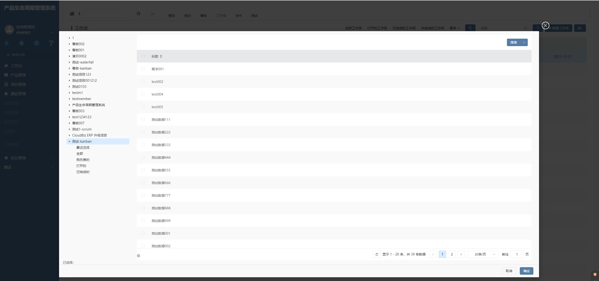
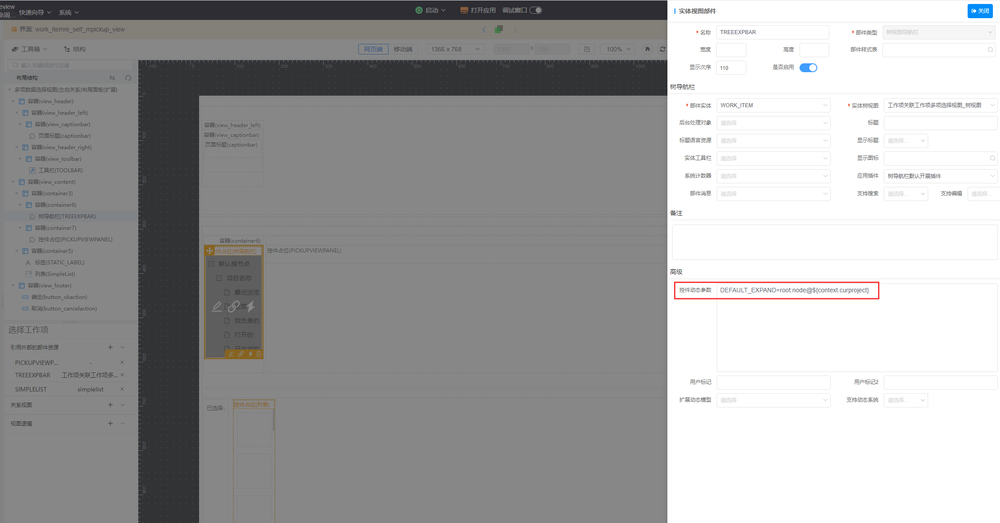

# 默认展开树导航
该插件是对树导航部件的功能增强，主要为了通过部件动态控件参数【DEFAULT_EXPAND】指定模态打开的树导航视图的默认展开及选中树节点。隶属于**自定义部件插件（树导航部件）**
其中DEFAULT_EXPAND的字符串识别${context.xxx}和${param.xxx}
## 场景


## 配置



## 附录：

### 树部件插件

```json
[
  {
    "plugintype": "TREE_RENDER",
    "rtobjectrepo": "@ibiz-template-plm/group-tree@0.0.2-alpha.17",
    "codename": "UsrPFPlugin1226747395",
    "plugintag": "GROUP_TREE",
    "rtobjectmode": 2,
    "rtobjectname": "IBizGroupTreeControl",
    "pssyspfpluginname": "分组树"
  }
]
```
