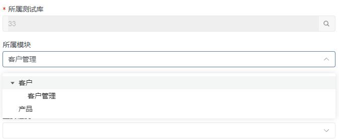

# 动态树选择插件

动态树选择是一个基于数据选择的插件，允许通过配置URL模板并结合动态参数的形式去动态计算URL，从而获取过滤后的指定是数据。

## 输入参数

| 属性      | 类型        | 默认值                        | 说明                                                         |
| --------- | ----------- | ----------------------------- | ------------------------------------------------------------ |
| URL       | string      | ---                           | 请求路径模板字符串 示例：`/libraries/${data.test_library_id}/test_suites/fetchdefault` |
| FILTERMAP | {}          | {"label":"name","value":"id"} | UI转化map                                                    |
| PVALUE    | string      | pid                           | 表示父的值的属性                                             |
| METHOD    | post \| get | post                          | 请求方式                                                     |

注：URL需要使用``进行包裹

在编辑表单内使用时，如果需要从外层传递数据进来，让插件初始化时显示指定值，需要再编辑视图的视图参数上配置视图参数，示例：SRFNAVPARAM.suite_id=%test_suite%，其中，suite_id表示插件所在表单项的值项名称，test_suite表示需要获取的在视图上下文或者视图参数中的值