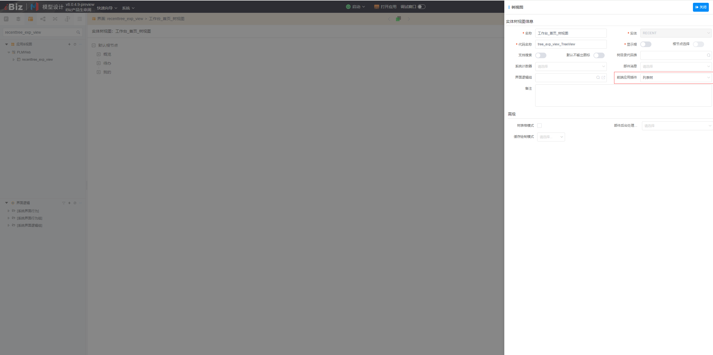
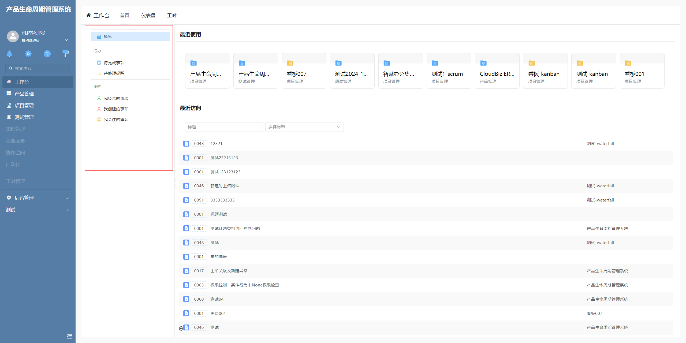

# 列表树

该插件是对树部件数据以列表的ui展示，实现了分组禁止收缩及所有分组项对齐的效果。**该插件隶属于树视图绘制插件（基于树部件进行扩展）**



## 页面展示



## 行为级别判断

[界面行为行为级别] {50：不常用、 100：一般操作、 200：常用操作、 250：关键操作 }

根据行为级别显示按钮，关键操作直接显示，常用操作不显示，一般操作及不常用在下拉菜单及右键菜单中显示。

## 附录

### 列表树插件

```json
[
  {
    "plugintype": "TREE_RENDER",
    "rtobjectrepo": "@ibiz-template-plm/list-tree@0.0.2-dev.19",
    "codename": "UsrPFPlugin0119481142",
    "plugintag": "LIST_TREE",
    "rtobjectmode": 2,
    "rtobjectname": "IBizListTreeControl",
    "pssyspfpluginname": "列表树"
  }
]
```
