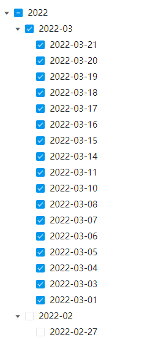
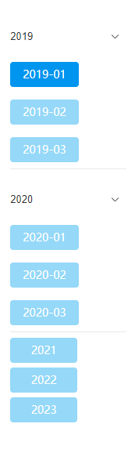

# 树形选项框列表

该插件是将选项框列表配置的代码表数据解析为树型数据，同时根据编辑器来进行各种维度的数据分组，对数据进行分层次展示，隶属于编辑器插件**（基于选项框列表标准编辑器扩展）**

### 页面展示



### horizontal模式


## 输入参数

| 名称             | 说明                                               | 类型                                                     | 默认值   |
| ---------------- | -------------------------------------------------- | -------------------------------------------------------- | -------- |
| GROUPMODEL       | 分组模式                                           | YEAR/QUARTER/MONTH/WEEK/<br />DAY/CODELIST/FIELD/NOGROUP | NOGROUP  |
| GROUPFIELD       | 分组属性，树结构判断标识                           | string                                                   | value    |
| GROUPCODELIST    | 根节点值，分组属性判断根值                         | Array                                                    | —        |
| EMPTYVALUE       | 当未选中数据时抛值                                 | string                                                   | —        |
| RENDERMODE       | 绘制模式                                           | TREE/BUTTON                                              | TREE     |
| MODE             | 模式                                               | horizontal/vertical                                      | vertical |
| DATESORT         | 时间排序，如果代码表数据为时间类型，将对其进行排序 | DESC \| ASC                                              | —        |
| LOADAFTER        | 加载之后事件hook，可对代码表数据进行调整           | scriptCode                                               | —        |
| SETDEFAULTSELECT | 设置默认选中数据                                   | scriptCode                                               | —        |
| SINGLESELECT     | 单项选择，为true时列表框为单选                     | boolean                                                  | false    |

## 事件

| 事件名 | 说明               | 参数                                                        |
| ------ | ------------------ | ----------------------------------------------------------- |
| change | 代码表数据选中事件 | 2个参数，分别是当前选择的值, 当前容器项（eg：表单项）的名称 |
| focus  | 聚焦               | \_event事件                                                 |
| blur   | 失焦               | \_event事件                                                 |

## 基本使用

在具体项目中，先通过模型导入编辑器插件、再导入编辑器样式，最后在具体的表单中选择对应的编辑器样式即可复用，其中编辑器插件和编辑器样式具体数据参见附录，相关示例如下。

### 示例

所有的hook事件代码中，都可以使用四个参数，

```
items:代码表数据
context:上下文参数
params:导航参数
data:表单（父级容器）数据
```

同时，它们的返回值如下所示：

```
LOADAFTER:返回一个对象数组
SETDEFAULTSELECT:返回一个字符串数组
```

### 基本配置

```
groupModel=CODELIST
GROUPFIELD=VALUE
GROUPCODELIST=[{"text":"分类一","value":"kind1"},{"text":"分类二","value":"kind2"},{"text":"分类三","value":"kind3"}]
LOADAFTER=return [{ text: '全选', value: 'all', children: items }]
```

### 禁用某一项

```
LOADAFTER=const index = items.findIndex((item) => Object.is(item.value, 'QQ'));if (index !== -1) {Object.assign(items[index], { disableSelect: true })}return [{ text: '全选', value: 'all', children: items}]
```


### 默认选中

```
SETDEFAULTSELECT=return ['微信']
```

### 单项选择

```
RENDERMODE=BUTTON
SINGLESELECT=true
```


### 多项选择

```
RENDERMODE=BUTTON
SINGLESELECT=false
```


### 按钮样式竖向布局分组

```
RENDERMODE=BUTTON
MODE=vertical
GROUPCODELIST=[{"text":"2019","value":"kind1"},{"text":"2020","value":"kind2"},{"text":"2021","value":"kind3"}]
```



### 按钮样式横向布局分组

```
RENDERMODE=BUTTON
MODE=horizontal
GROUPCODELIST=[{"text":"2019","value":"kind1"},{"text":"2020","value":"kind2"},{"text":"2021","value":"kind3"}]
```


## 附录

### 编辑器插件

```json
[
  {
    "plugintype": "EDITOR_CUSTOMSTYLE",
    "rtobjectrepo": "@ibiz-template-plugin/checkbox-list-extend@0.1.0",
    "codename": "UsrPFPlugin1203975787",
    "plugintag": "EXTEND",
    "rtobjectmode": 2,
    "rtobjectname": "IBizCheckboxListExtend",
    "pssyspfpluginname": "选项框列表增强"
  }
]
```

### 编辑器样式：

```json
[
  {
    "codename": "EXTEND",
    "pssyspfpluginid": "UsrPFPlugin1203975787",
    "repdefault": 0,
    "validflag": 1,
    "pssyseditorstylename": "选项框列表增强",
    "pseditortypeid": "CHECKBOXLIST"
  }
]
```
