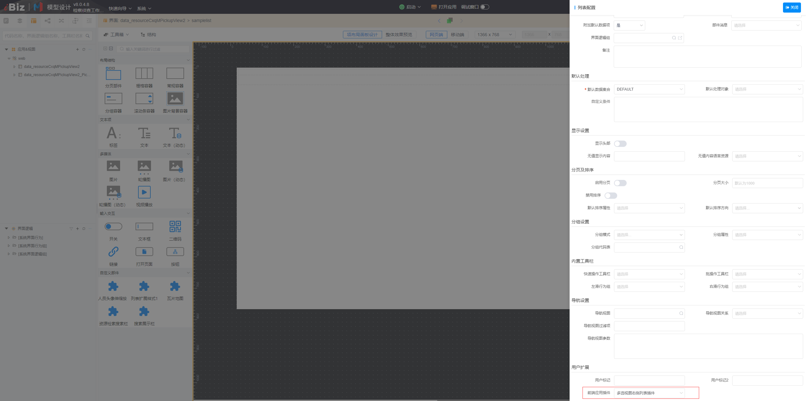
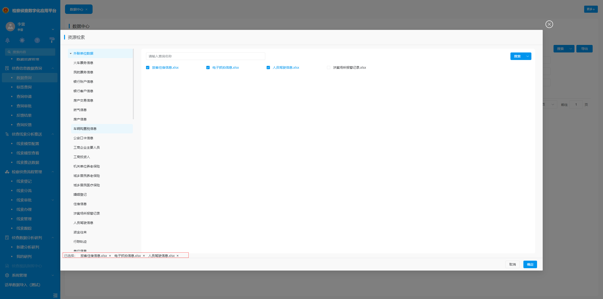

# 简单列表

该插件以最简单的形式绘制列表，且在多选视图中使用是可点击删除图标取消选中，**该插件隶属于部件插件（基于标准列表部件进行扩展）**。



## 页面展示 



## 基本使用

在具体项目中，先通过模型导入简单列表插件，然后在具体的多选视图中给右侧列表选择对应的扩展即可复用，无其他配置，其中简单列表插件的具体数据参见附录。

## 附录：

### 简单列表插件

```json
[
  {
    "plugintype": "LIST_RENDER",
    "rtobjectrepo": "@ibiz-template-plugin/sample-list@0.1.0",
    "codename": "UsrPFPlugin1031545766",
    "plugintag": "SAMPLE_LIST",
    "rtobjectmode": 2,
    "memo": "1",
    "rtobjectname": "IBizSampleList",
    "pssyspfpluginname": "简单列表",
    "previewhtml": "<div>插件标识: SAMPLE_LIST</div>\n<div>\n<p>运行时插件名称：IBizSampleList</p>\n<p>&nbsp;运行时插件仓库配置: @ibiz-template-plugin/sample-list@0.1.0</p>\n</div>\n<div>&nbsp;</div>"
  }
]
```
